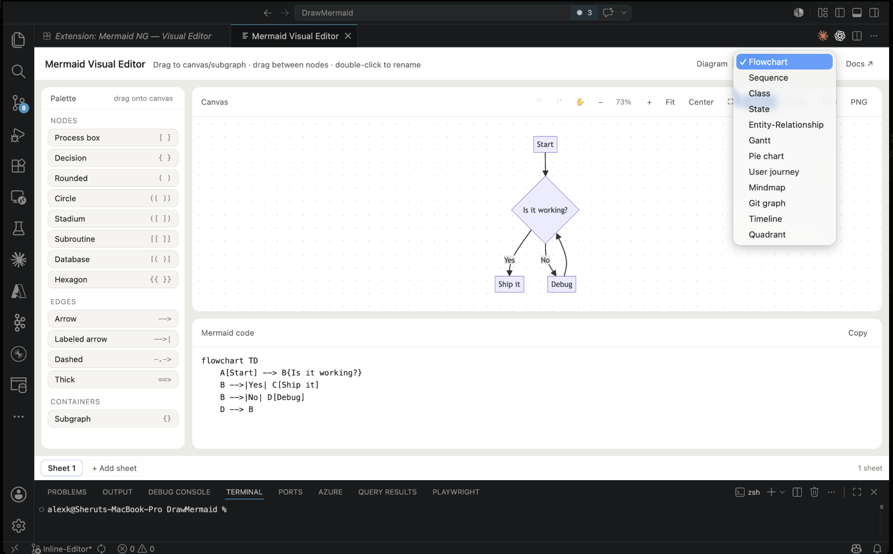

# Mermaid 편집기 UI/UX 와이어프레임

## 작업 시 참고

모든 UI와 상호작용 로직은 [레퍼런스 레포](https://github.com/NextGenPowerToys/mermaid-visual-editor)에 있다. 그것을 그대로 사용하면 된다.
이 SDK는 mermaid 코드블럭 하나에 대응하도록 설계한다.

## 목적과 범위

이 문서는 Mermaid 문자열 하나를 시각 편집하는 화면에서 사용자가 보는 영역, 입력, 상태와 조작 흐름을 정의한다. 구현 방식이나 SDK props/API, 파일 저장 방식을 정하지 않는다. 팔레트 항목의 정확한 이름·순서·아이콘 표기는 [팔레트 카탈로그](./PALETTE-CATALOG.md)를 기준으로 한다.

한 화면은 Mermaid 다이어그램 하나를 다룬다. Markdown 문서 안에 코드 블록이 여러 개 있어도 이 화면에는 선택된 한 블록만 나타난다. 시트 탭, 블록 선택기, 블록 간 전환은 이 화면의 범위가 아니다. 한 다이어그램 안의 subgraph는 같은 캔버스에서 다룬다.

## 기준 화면

아래 이미지는 Mermaid Visual Editor v2.5.0의 기준 화면이다. 앱의 좌우 탐색 막대와 아래 패널은 VS Code chrome이므로 제품 화면의 일부가 아니다. selector가 열린 상태의 이미지는 12종 목록과 palette–canvas–source 배치를 보여 준다.



기준 소스는 커밋 `8f9bbc90f9f33a13cb5e2eda44100856795c4c01` (`Release v2.5.0`)이다. 로컬 Cursor에서 확인한 설치 확장은 `NGPowerToys.mermaid-visual-editor@1.1.0`이며 Mermaid 10.9.0을 포함한다. 설치본은 시트 탭과 시트 추가, Undo/Redo, Pan, 전체 화면, SVG/PNG export 등 이 단일 다이어그램 명세에 없는 UI도 노출했다. 따라서 설치본의 화면은 현재 동작 확인에만 쓰고, 다이어그램 종류별 팔레트와 제스처는 v2.5.0 소스 및 그림을 기준으로 삼는다.

## 화면 배치

```text
┌──────────────────────────────────────────────────────────────────────────────┐
│ Diagram                                               [ Flowchart ▾ ]         │
├──────────────────┬───────────────────────────────────────────────────────────┤
│ Palette          │ Canvas                  −   100%   +   Fit   Center  Save │
│                  │                                                           │
│ NODES            │             선택·이동·연결하는 다이어그램 캔버스             │
│ ...              │                                                           │
│ EDGES            ├───────────────────────────────────────────────────────────┤
│ ...              │ Mermaid code                                              │
│ CONTAINERS       │ flowchart TD                                              │
│ ...              │   A[Start] --> B{Decision}                                │
└──────────────────┴───────────────────────────────────────────────────────────┘
```

| 영역 | 화면에서 보이는 것과 목적 |
| --- | --- |
| 헤더 왼쪽 | `Diagram` 이름. 현재 열려 있는 한 다이어그램의 편집 맥락을 알려 준다. |
| 헤더 오른쪽 | 다이어그램 종류 선택기. Flowchart, Sequence, Class, State, Entity-Relationship, Gantt, Pie chart, User journey, Mindmap, Git graph, Timeline, Quadrant 순이다. |
| 왼쪽 팔레트 | 선택한 종류에서 추가할 수 있는 요소를 그룹으로 보여 준다. 개별 이름·아이콘·순서는 팔레트 카탈로그를 따른다. |
| 오른쪽 캔버스 | 다이어그램을 선택하고 배치·연결하는 작업 영역. 선택, 드래그, 확대 상태가 여기에 보인다. |
| 캔버스 툴바 | 왼쪽부터 확대, 현재 배율, 축소, Fit, Center, Save, Reset. 다른 도구는 이 명세의 툴바에 추가하지 않는다. |
| 하단 Mermaid 코드 | 현재 다이어그램의 Mermaid 원문 한 개를 직접 입력·확인하는 영역. 입력 내용은 캔버스에 반영된다. |

화면은 palette와 오른쪽 작업 열을 나란히 놓는다. 오른쪽 열은 위쪽 캔버스, 아래쪽 코드 영역으로 쌓는다. 경계가 분명하고 코드와 캔버스가 같은 다이어그램을 나타내는 것이 기본 상태다.

## 사용자 흐름

### 다이어그램 종류 선택

사용자가 헤더의 종류 선택기를 열면 지원되는 12종이 표시된다. 현재 종류가 선택 상태로 나타난다. 종류를 바꾸면 헤더, 팔레트와 편집 영역의 입력 방식이 새 종류에 맞게 갱신된다. 기존 편집이 사라질 수 있는 전환에는 이를 먼저 알리고, 계속/취소를 선택하게 한다.

### 요소 선택과 편집

캔버스 요소를 한 번 누르면 해당 요소가 강조되고 선택 상태를 확인할 수 있다. 다시 두 번 누르면 편집 대화상자가 열린다. 노드·관계선·subgraph마다 제목과 입력 항목을 구분한다. 편집 중에는 적용, 취소, 해당 요소 삭제를 분명히 구분한다.

- **노드/요소:** 이름 또는 표시 문구를 편집한다. Class는 멤버와 공개 범위, ER은 필드의 자료형·이름·키 종류, 지원하는 노드에는 테두리 선과 채우기/테두리 색 입력을 함께 보여 준다.
- **관계선/edge:** 양 끝 요소 이름이 제목에 표시된다. Flowchart 계열은 선 문구, 방향, 선 모양과 끝 화살촉을 편집한다. Class는 관계 종류와 방향, ER은 cardinality와 관계 문구, State transition은 문구를 보여 준다.
- **Subgraph:** 제목, 테두리 선, 채우기 색, 테두리 색을 편집한다.
- **다른 다이어그램 종류:** 팔레트가 `PALETTE-CATALOG.md`의 구조·데이터 그룹과 항목을 제공한다. 원문 영역에서 직접 고칠 수 있다. 기준 v2.5.0에서 캔버스 더블클릭 편집 대화상자가 제공되지 않는 항목까지 대화상자가 있는 것처럼 표시하지 않는다.

대화상자는 열릴 때 첫 입력 칸에 키보드 포커스를 둔다. 여러 줄 이름/문구는 textarea에서 입력한다. `Enter`는 줄바꿈, `Cmd/Ctrl+Enter`는 적용이다. `Escape` 또는 취소는 변경을 적용하지 않고 닫는다. 적용은 캔버스와 코드 영역에 결과를 반영하고, 실패하면 원인을 알 수 있는 상태 문구를 보여 준다.

### 팔레트에서 추가

팔레트 항목을 캔버스로 끌면 포인터 위치 또는 가리키는 subgraph에 새 요소가 놓인다. 노드 위에 놓을 수 있는 경우 대상이 강조되어 추가 위치를 미리 알 수 있다. 항목을 한 번 누르는 방식으로도 추가를 시작할 수 있다. 관계선처럼 연결 시작이 필요한 항목은 먼저 선택/무장 상태가 되고, 그다음 캔버스에서 출발 노드와 도착 노드를 지정한다.

### 연결과 끝점 이동

노드에서 다른 노드로 끌면 임시 연결선과 도착 대상 강조가 나타난다. 유효한 대상에서 놓으면 관계가 생기고, 빈 곳이나 유효하지 않은 대상에서 놓으면 관계가 추가되지 않는다. 기존 edge의 끝 가까이에서 끌기를 시작해 다른 노드에 놓으면 그 끝점이 이동한다. 이동 중 새 대상이 강조되고, 취소되거나 유효하지 않은 대상에 놓으면 기존 연결이 유지된다.

### Mermaid 코드 직접 편집

아래 코드 영역에서 Mermaid 문장을 입력하거나 붙여 넣는다. 편집 중 캔버스에는 마지막으로 유효하게 그려진 결과와 오류 상태가 구분되어 나타난다. Mermaid 파싱 오류가 있으면 캔버스에 오류 표시와 읽을 수 있는 안내를 제공하고, 원문은 코드 영역에 남겨 수정할 수 있게 한다. 캔버스 편집으로 지원되지 않는 구문을 조용히 제거하지 않는다.

## 툴바

| 순서 | 컨트롤 | 사용자가 하는 일과 확인할 피드백 |
| --- | --- | --- |
| 1 | `+` 확대 | 한 단계 확대한다. 배율 표시가 새 값으로 바뀐다. |
| 2 | 배율 표시 | 현재 확대 배율을 읽는다. |
| 3 | `−` 축소 | 한 단계 축소한다. 배율 표시가 새 값으로 바뀐다. |
| 4 | `Fit` | 다이어그램 전체가 캔버스 안에 보이도록 맞춘다. |
| 5 | `Center` | 현재 배율을 유지하며 다이어그램을 캔버스 가운데로 옮긴다. |
| 6 | `Save` | 사용자가 현재 다이어그램을 저장하겠다는 의사를 실행한다. 완료 또는 실패 상태를 화면에서 확인할 수 있다. 저장 위치나 저장 대화상자 동작은 여기서 정하지 않는다. |
| 7 | `Reset` | 현재 편집을 초기 상태로 되돌린다. 변경이 있으면 실행 전에 되돌릴 수 있음을 알리고, 실행 후 초기화 완료 상태를 보여 준다. |

## 우클릭과 키보드·포인터 조작

| 입력 | 사용자가 경험하는 흐름 |
| --- | --- |
| 캔버스에서 요소 한 번 클릭 | 요소를 선택 상태로 강조한다. |
| 캔버스 요소 두 번 클릭 | 해당 노드, edge 또는 subgraph 편집 대화상자를 연다. |
| 요소 위에서 `Backspace` 또는 `Delete` | 입력 칸을 편집 중이 아닐 때 포인터 아래의 노드/edge를 삭제한다. 짧은 상태 문구로 삭제 결과를 알린다. |
| 요소 또는 캔버스에서 우클릭 | 기준 구현에는 편집 전용 우클릭 메뉴가 없다. Cursor 설치본에서 확인한 우클릭은 기본 Cut/Copy/Paste 메뉴를 열었다. 우클릭으로 삭제·편집·재연결 메뉴를 제공한다고 기대하지 않도록 안내한다. |
| `Cmd/Ctrl+Z` | 직전 변경을 취소하고 캔버스와 코드가 함께 이전 상태로 돌아간다. |
| `Cmd+Shift+Z` 또는 `Ctrl+Y` | 취소한 변경을 다시 적용한다. |
| 마우스 휠 또는 트랙패드 핀치 | 포인터/제스처 방향에 따라 캔버스 배율을 조정한다. 배율 표시가 갱신된다. |
| Pan 조작 상태에서 드래그 또는 `Space`+드래그 | 캔버스를 이동한다. 요소를 끌어 편집하는 흐름과 구별되는 손 모양 커서/이동 상태를 보여 준다. |
| `Cmd/Ctrl+S` | Save 동작을 실행한다. 결과 상태를 툴바 가까이에서 확인한다. |
| 대화상자에서 `Escape` | 편집을 적용하지 않고 닫는다. |
| 대화상자의 여러 줄 입력 중 `Enter` | 줄바꿈을 입력한다. |
| 대화상자에서 `Cmd/Ctrl+Enter` | 입력 변경을 적용한다. |
| Mermaid 코드 영역에서 키 입력 | 원문을 직접 편집한다. 캔버스는 변경된 문법을 반영하고, 오류가 있으면 오류 상태를 보여 준다. |

`Backspace`와 `Delete`는 텍스트 입력 중에는 요소 삭제로 동작하지 않는다. 우클릭에 대한 현재 구현 확인과 기준 버전 차이는 위 기준 화면 단락과 동일하게 해석한다.

## 상태와 피드백

- **선택:** 클릭한 대상에 테두리 또는 명확한 강조를 주고, 필요한 경우 식별 가능한 이름을 함께 표시한다.
- **팔레트 드래그:** 드래그 중인 항목을 반투명하게 하고, 캔버스 drop 가능 영역 및 대상 노드/subgraph를 강조한다.
- **관계 연결/끝점 이동:** 임시 연결선을 보이고, 놓을 수 있는 대상과 현재 도착 대상을 구별한다.
- **편집 대화상자:** 포커스가 있는 입력을 강조한다. 적용/취소/삭제 동작은 서로 다른 버튼으로 표시한다. 삭제는 위험을 알아볼 수 있는 색과 문구로 강조한다.
- **오류:** 파싱 오류, 지원하지 않는 시각 편집, 저장 실패는 각각 구분해 안내한다. 사용자가 고칠 수 있도록 원문 코드를 유지한다.
- **완료:** Save, Reset, 추가, 편집, 삭제 결과는 짧고 명확한 상태 문구 또는 갱신된 화면으로 알린다.

## 좁은 화면

넓은 화면에서는 팔레트가 왼쪽에, 캔버스와 코드가 오른쪽 위아래로 놓인다. 폭이 좁아지면 팔레트는 위쪽의 독립 영역으로 이동하고 캔버스와 코드는 그 아래에 세로로 쌓인다. 헤더의 종류 선택기는 줄바꿈 또는 축약된 너비 안에서도 선택 이름을 알아볼 수 있어야 한다. 팔레트는 항목 이름이 읽히고 선택/추가하기 편한 공간을 확보한다. 툴바는 버튼이 겹치지 않게 줄바꿈하거나 스크롤 가능한 한 줄로 정리한다. 편집 대화상자는 화면 안에 들어오도록 폭을 줄이고 내용이 길 때 내부를 스크롤한다.

## 기준 구현과 차이가 나는 범위

| 관찰 항목 | 기준 v2.5.0 / 설치본 확인 | 이 명세 |
| --- | --- | --- |
| 시트 | 설치본 1.1.0 화면은 3개 sheet와 추가 버튼을 표시한다. | 화면 하나는 Mermaid 문자열 하나만 편집한다. sheet와 블록 탐색/전환 UI를 두지 않는다. |
| 툴바 | v2.5.0은 Undo/Redo, Pan, 전체 화면, SVG/PNG 다운로드도 제공한다. 설치본 1.1.0도 추가 툴을 보여 준다. | 요청된 확대, 배율, 축소, Fit, Center, Save, Reset만 명세한다. |
| 우클릭 | Cursor 설치본 캔버스 우클릭은 기본 Cut/Copy/Paste 메뉴를 열었다. 편집 전용 메뉴는 확인되지 않았다. | 편집 전용 우클릭 동작이 있다고 명세하지 않는다. |
| 대화상자 | v2.5.0의 노드·관계선·subgraph 편집 항목은 종류에 따라 달라진다. | 확인 가능한 공통/종류별 항목을 서술하며, 대화상자가 없는 유형은 팔레트와 원문 영역을 안내한다. |

이 차이는 명세의 의도된 범위 결정이다. 상세 팔레트 데이터는 v2.5.0에서 항목별로 대조할 수 있도록 [PALETTE-CATALOG.md](./PALETTE-CATALOG.md)에 정리했다.
