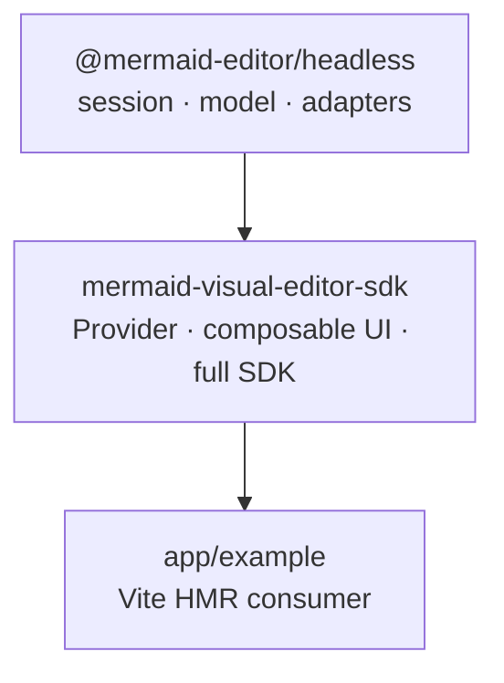

# Turbo 모노레포 전환 설계

상태: **완료** — 설계·구현·검증을 마쳤다. 마지막 검증에서 `pnpm install --frozen-lockfile`, `pnpm build`, `pnpm typecheck`, `pnpm lint`, `pnpm test`(UI 99개, headless 236개 통과), CJS 공개 export smoke check, 브라우저 HMR, `pnpm audit:distribution`이 통과했다.

## 목표와 사용자 결과

이 저장소를 `app/example`, `package/ui`, `package/headless`를 가진 Turbo 기반 모노레포로 바꾼다.

- `app/example`은 실제 SDK 패키지를 import하는 Vite 앱이다. SDK 소스 수정 시 브라우저에서 HMR로 결과를 확인할 수 있어야 한다.
- `package/ui`는 바로 쓸 수 있는 전체 Mermaid 에디터와 합성 가능한 UI 조각을 배포한다. 사용자는 전체 SDK 또는 `ToolSidebar`, session `Provider`/hooks, `SourceEditor`, `MermaidCanvas` 및 필요한 UI 조각을 직접 조합할 수 있어야 한다.
- `package/headless`는 UI와 React에 의존하지 않는 세션·diagram model·adapter·source mutation 로직을 배포한다. 사용자는 이를 이용해 완전히 다른 DOM/스타일의 에디터를 만들 수 있어야 한다.
- Turbo는 workspace package dependency graph를 사용해 build/typecheck 작업 순서를 계산하고, 각 package/app의 작업 및 산출물을 캐시한다.
- 패키지 매니저는 이 설계에서 `pnpm`으로 통일한다. 기존 단일 `package-lock.json`과 npm 설치보다 workspace 전용 `workspace:` 의존성, package별 의존성 격리, 단일 `pnpm-lock.yaml`을 우선한다.

## 참고한 React 편집기 SDK와 도구 설계

이 프로젝트는 하나뿐인 Mermaid editor SDK다. 따라서 Mermaid 편집기 예제만 찾는 대신, React에서 완성형 UI와 headless logic을 모두 제공하는 편집기 SDK의 package 경계·provider·composable UI 방식을 비교했다.

| SDK | 공식 문서에서 확인한 구조 | 이 프로젝트에 적용할 점 |
|---|---|---|
| [Tiptap](https://tiptap.dev/docs/editor/getting-started/style-editor) / [Tiptap UI Components](https://tiptap.dev/docs/ui-components/getting-started/overview) | Core/extensions는 UI 없는 headless 방식이고, 선택형 React UI component는 core 기능과 hooks를 사용한다. 일부 UI는 package로 배포되고, 일부는 CLI로 consumer app에 복사해 소유한다. | logic capability와 React UI 조각을 나누고, 각 UI를 필요한 headless 기능에 명시적으로 연결한다. 이 SDK는 UI도 버전·타입이 함께 보장되는 public package API로 배포한다. |
| [Lexical](https://github.com/facebook/lexical/blob/main/packages/lexical-headless/README.md) | DOM이 없는 Node 환경에서 editor state/API를 쓸 수 있는 `@lexical/headless`를 별도 package로 제공하고, DOM/React 기능은 별도 React package에서 제공한다. | headless package에 React와 DOM global import가 유입되지 않는다는 완료 조건을 둔다. 다만 Mermaid SVG rendering은 선택적인 UI renderer adapter로 둔다. |
| [BlockNote](https://www.blocknotejs.org/docs/react/overview) / [UI Components](https://www.blocknotejs.org/docs/react/components) | React hook이 editor instance를 만들고 full `BlockNoteView`를 렌더한다. formatting toolbar, slash menu, side menu 등을 비활성화하거나 교체 가능하며, 테마와 CSS도 조절할 수 있다. | 전체 editor shell과 UI slot/component API를 모두 제공해 초보자는 full SDK를, 숙련자는 독립 UI parts를 사용할 수 있게 한다. |
| [Plate](https://platejs.org/docs) / [installation paths](https://platejs.org/docs/installation) | `platejs` runtime과 headless plugin packages, 선택형 styled UI registry를 구분한다. UI registry 코드는 app-local로 복사해 consumer가 직접 소유한다. | core/plugin과 UI 경계를 분리한다. 우리 목표는 UI component를 직접 수정해 소유하는 소비자 사례도 지원하지만, 사용자 요청에 맞춰 SDK UI part 조합/스타일링을 package export로 지원한다. |
| [tldraw editor](https://tldraw.dev/sdk-features/editor) / [UI components](https://tldraw.dev/sdk-features/ui-components) | editor state·commands와 full React UI를 구분한다. UI slots, Context providers, hooks로 toolbar와 다른 UI 영역을 교체하거나 숨긴다. | full SDK와 교체 가능한 UI slots를 제공하며, 전용 session Provider/hook으로 여러 component가 같은 session을 공유하게 한다. |
| [React Flow providers and hooks](https://reactflow.dev/learn/advanced-use/hooks-providers) | ReactFlowProvider가 state context를 제공하며 hooks로 instance와 method를 읽고 조작한다. | `useDiagramSession`과 provider를 public surface로 내보내 코드 editor, toolbar, renderer를 다른 순서/레이아웃으로 조립할 수 있게 한다. |

공통 설계 패턴은 **editor instance/session API를 UI layout보다 아래 계층에 두고, 기본 UI를 작은 교체·재조합 가능한 component로 제공하는 것**이다. Mermaid editor의 도메인 특성에 따라 Tiptap/BlockNote의 문서 내용 모델을 복제하지는 않는다. Mermaid source는 주석·metadata·공백을 보존해야 하므로 현재 `SourceDocument`, source adapter, revision 관리 model을 headless 경계로 옮기고 Mermaid SVG DOM interaction은 UI renderer 경계에 둔다.

Turbo 구성 근거는 [package/task graph](https://turborepo.dev/docs/core-concepts/package-and-task-graph), [task configuration](https://turborepo.dev/docs/crafting-your-repository/configuring-tasks), [internal packages](https://turborepo.dev/docs/crafting-your-repository/creating-an-internal-package)다. `ui -> headless`, `example -> ui` 관계가 build 순서와 cache graph에 반영되도록 한다.

이 저장소의 [React 전환 설계](react-design.md), [SDK 계약](decisions/sdk-contract.md), [source fidelity 설계](decisions/source-fidelity.md), [Mermaid SDK 목적 및 설계](mermaid-editor-sdk/DESIGN.md)는 현 기능과 원문 보존 계약의 근거다. 원본 editor의 기능 비교는 [upstream Mermaid Visual Editor](https://github.com/NextGenPowerToys/mermaid-visual-editor)와 기존 [지원 matrix](research/support-matrix.md)를 기준으로 한다.

## 대상 폴더 구조

```text
.
├── app/
│   └── example/                 # Vite HMR consumer, 실제 SDK public entry 사용
├── package/
│   ├── headless/                # UI/React 없는 session, model, adapters, source 로직
│   └── ui/                      # full SDK와 조합 가능한 React UI component
├── docs/
├── turbo.json                   # task graph, cache outputs, persistent dev tasks
├── pnpm-workspace.yaml          # app/** 및 package/** workspace 검색
├── package.json                 # private workspace root, turbo scripts/dev dependency
└── pnpm-lock.yaml
```

의존 방향은 단방향으로 유지한다.



`headless`는 React, ReactDOM, CSS, DOM element를 import하지 않는다. Mermaid diagram classification, source mutation, diagram model, editor session/controller와 history를 제공한다. Mermaid SVG rendering 및 pointer/SVG interaction은 `ui` 소유다. `example`은 패키지 내부 파일 상대경로를 직접 import하지 않고 `mermaid-visual-editor-sdk`의 public API를 사용한다.

## 패키지 계약

### `@mermaid-editor/headless`

- 책임: `DiagramSession`, source/model revision 동기화, history 및 selection state, typed diagram actions, validation, diagram capability/catalog, 원문을 보존하는 source mutations, UI가 필요한 immutable snapshot.
- 금지 의존성: `react`, `react-dom`, React UI toolkit, CSS 및 브라우저 DOM UI 코드.
- export: `.` core/session/source API와 types. package entry는 ESM/CJS/type export를 제공한다.
- headless consumer는 Mermaid source와 편집 model/session을 다룬다. Mermaid SVG preview가 필요하면 소비자가 원하는 renderer를 별도로 연결한다.

### `mermaid-visual-editor-sdk`

- 책임: headless를 조합한 `MermaidEditor` 전체 SDK, session Provider와 React hooks, 왼쪽 `ToolSidebar`, `DiagramPalette`, 코드블럭 `SourceEditor`, `MermaidCanvas`/renderer adapter, diagram 선택·selection editor·status와 SDK CSS.
- 기본 import `mermaid-visual-editor-sdk`는 전체 기능을 갖춘 `<MermaidEditor />`를 제공한다.
- 안정적인 세부 entry: `mermaid-visual-editor-sdk/provider`, `mermaid-visual-editor-sdk/toolbar`, `mermaid-visual-editor-sdk/source`, `mermaid-visual-editor-sdk/renderer`, `mermaid-visual-editor-sdk/components`, `mermaid-visual-editor-sdk/style.css`.
- UI 조각은 Provider 기반 component와, 가능한 경우 명시적 props/action API를 함께 제공한다. Provider 없는 component 사용은 명확한 runtime/use-time 오류로 안내한다.
- `react`와 `react-dom`은 peer dependency로 두고 bundle에 복제하지 않는다. `@mermaid-editor/headless`는 workspace dependency로 연결한다.
- existing React SDK가 공개한 imperative legacy API의 호환 entry는 기존 `./legacy` 계약을 유지한다. package split에서 기존 public entry나 browser target을 조용히 제거하지 않는다.

### `app/example`

- 별도 Vite React app으로 실행하고 workspace public package name으로 SDK를 import한다.
- Vite development resolution은 SDK의 source condition을 선택해 workspace TS/TSX의 HMR을 유지한다. production build는 package의 built exports를 검증한다.
- 기존 `index.html`, `src/dev.tsx`는 이 app의 실행 진입으로 이동한다. 예제 화면은 현재 full editor UI와 주요 interaction을 보여준다.

## 파일 이동 및 모듈 경계 초안

현재 React SDK 구현을 기준으로 다음 책임으로 나눈다. import graph를 따라 옮기며 barrel export를 명시한다.

| 현재 코드 책임 | 대상 경계 | 판정 기준 |
|---|---|---|
| `src/core/diagram-model.ts`, `diagram-session.ts`, controller의 UI 무관 명령 및 selection mapping | `package/headless/src/` | React/DOM/CSS import 없이 빌드 가능 |
| `src/source/**`, diagram capability/catalog 및 source mutations | `package/headless/src/` | 원문 주석/metadata/공백 보호 동작 유지 |
| `src/ui/**`, `src/styles/editor.css` | `package/ui/src/` | UI는 headless public/internal contracts를 통해 session과 통신 |
| Mermaid SVG rendering의 DOM 의존 코드 | `package/ui/src/renderer/` 및 canvas component | headless package import가 `document`, `HTMLElement`, Mermaid render DOM 호출에 오염되지 않음 |
| `src/dev.tsx`, `index.html` | `app/example/` | workspace package public export를 통해 SDK 소비 |
| legacy imperative API 및 browser entry | `package/ui/src/legacy/` 또는 package export boundary | React root API와 명시적인 별도 entry 유지 |

현재 `src/runtime/create-editor.ts`와 `src/diagrams/*-adapter.ts`는 DOM UI 및 SVG interaction과 source mutation 호출이 섞여 있다. DOM-bound adapter와 legacy runtime은 `ui`에 둔다. React UI는 headless session/controller command로 모델을 갱신하고 Mermaid canvas는 별도의 rendering adapter를 소유한다.

## Turbo와 패키지 매니저

- 루트 `package.json`은 `private: true`, `packageManager: "pnpm@<실제 고정 버전>"`, `dev`, `build`, `typecheck`, `lint`, `test`의 `turbo run ...` script를 소유한다.
- `pnpm-workspace.yaml`에는 `app/*`, `package/*`를 포함한다. `pnpm-lock.yaml` 하나로 workspace dependency graph를 기록한다.
- 내부 의존은 `workspace:*`로 선언해 로컬 package 연결이 실패하면 registry package로 묵시 대체되지 않도록 한다.
- 루트 `turbo.json`에서 `build`는 `^build`에 의존하고 산출물(`dist/**`, 필요한 type outputs)을 캐시한다. `typecheck`, `lint`, `test`는 관련 upstream task dependency를 표현한다. `dev`는 `persistent: true`, `cache: false`로 둔다.
- 기존 root SDK build 설정을 바로 폐기하지 않는다. 먼저 package-local Vite/TypeScript config로 책임을 옮기고, root는 orchestration만 한다.
- `npm` 실행 및 `package-lock.json`은 제거해 pnpm만 canonical installer/lockfile이 되게 한다. CI/개발 문서도 pnpm 명령으로 갱신한다.

## 구조를 확정한 이유

- **Headless보다 큰 UI 의존 방향:** full SDK 소비자는 준비된 에디터를 쉽게 쓰고, 커스터마이징 소비자는 UI parts를 조립하며, 스타일 자유도가 필요한 소비자는 React/UI 없이 core logic을 쓸 수 있다.
- **단일 SDK package의 optional component export만으로 처리하지 않음:** 사용자가 `headless`만 설치하면 React와 UI/CSS runtime을 내려받지 않고 자신이 선택한 UI framework로 editor를 만들 수 있어야 한다.
- **rendering은 optional adapter boundary:** 현재 Mermaid의 SVG renderer와 selection mapping은 browser DOM을 필요로 하지만, source/model/session 논리를 그 전역 상태와 묶지 않도록 한다.
- **기존 지원 범위를 package boundary 변경으로 축소하지 않음:** 현재 12개 diagram 지원, source fidelity, undo/redo, public API, CSS, legacy consumer를 전부 migration 요구사항으로 유지한다.
- **pnpm + Turbo:** workspace package identity와 task dependency graph를 lockfile에 명시하고, app과 library를 같은 작업 graph에서 순서대로 개발/build한다.

## 거시적 진행 순서

1. **설계 기준선과 현 상태 확인:** 현재 root package exports/build, React UI/core import graph, legacy output, supported diagrams와 source fidelity 계약을 기록한다. 완료하면 대상 entry와 boundary가 이 문서와 일치한다.
2. **Workspace scaffold와 package-manager 전환:** pnpm workspace, root Turbo scripts/config, 세 package manifests 및 lockfile을 만든다. 완료하면 `pnpm install --frozen-lockfile`로 workspace를 재구성할 수 있다.
3. **Headless package 추출:** UI 없는 session/model/source/adapters를 이동하고 public exports를 정리한다. 완료하면 headless package dependency/import graph 어디에도 React, ReactDOM, CSS, UI component, DOM global 의존성이 없다.
4. **UI package 추출과 합성 API:** React components/provider/hooks/styles/renderer를 이동하고 headless workspace dependency와 subpath exports를 추가한다. 완료하면 full SDK와 각 UI part가 public exports에서 소비된다.
5. **HMR example 연결:** Vite app을 만들고 public `mermaid-visual-editor-sdk` entry를 source condition으로 개발한다. 완료하면 앱에서 full SDK가 실행되고 패키지 TSX 수정이 브라우저에 HMR 반영된다.
6. **기존 계약 이관 및 문서화:** imperative legacy entry, styles, browser/build outputs, licensing, consumer/dev docs와 CI 명령을 갱신한다. 완료하면 이전 public entry의 명시된 소비자가 계속 사용할 수 있고 migration 명령이 일관된다.
7. **완료 감사:** 설치·build·typecheck 및 기존 test suite, example dev/HMR, package exports, headless dependency graph, licensing/distribution, 12 diagram/source fidelity를 증거로 검사한다. 누락/의도적 차이는 설계 및 완료 보고에 설명한다.

## 완료 상태 체크리스트

### 선행 설계

- [x] SDK 사례를 조사하고 UI/Core 분리, Provider/hooks, composable UI 구조를 reference URL과 함께 기록했다.
- [x] 목표 폴더, dependency 방향, 각 package의 책임·public exports, pnpm/Turbo 선택을 정의했다.
- [x] 거시적 진행 순서와 단계별 완료 판정 기준을 기록했다.

### Monorepo scaffold

- [x] root workspace는 private이고 `pnpm-workspace.yaml`이 app/package 경로를 포함한다.
- [x] root `turbo.json` task graph는 package dependency 순서, build outputs cache, persistent dev task를 설정한다.
- [x] package manager와 버전이 root에 pin되어 있고, 단일 `pnpm-lock.yaml`이 frozen install을 지원한다.
- [x] 예전 root package의 npm lock/config 소유권이 제거되거나 의도된 package-local 소유권으로 옮겨졌다.

### Headless package

- [x] `@mermaid-editor/headless`가 설치 가능한 package metadata, exports, declarations, build 산출물을 가진다.
- [x] session/model/source adapter 및 원문 보존 편집 로직이 `headless`에서 동작한다.
- [x] `headless`의 production dependencies와 emitted imports에 React/ReactDOM/UI/CSS/DOM 전용 코드가 없다.
- [x] headless public API만 import해 사용자 정의 UI를 만들 수 있다.

### UI package

- [x] `mermaid-visual-editor-sdk` 기본 export로 현재 full SDK가 제공된다.
- [x] Provider/hooks, 좌측 toolbar, code source editor, Mermaid canvas renderer와 필요한 UI 조각이 안정된 subpath/public component exports다.
- [x] UI는 `headless` package dependency를 통해서만 logic/session과 결합한다.
- [x] CSS 및 legacy imperative/browser exports가 문서화된 package paths에서 생성·소비된다.

### Example과 완료 검증

- [x] `app/example`은 workspace public package specifier로 SDK를 사용한다.
- [x] `pnpm dev`로 example 웹앱이 켜지고 SDK source 수정이 브라우저 HMR로 반영된다.
- [x] Turbo build와 typecheck가 graph 순서대로 끝난다.
- [x] 기존 test suite와 diagram/source fidelity/legacy consumer 확인이 통과한다 (UI 99개, headless 236개).
- [x] third-party license/distribution 검사가 새 package outputs 기준으로 통과한다.
- [x] README와 개발 문서는 새 package별 설치/개발/export 경로와 명령을 안내한다.
