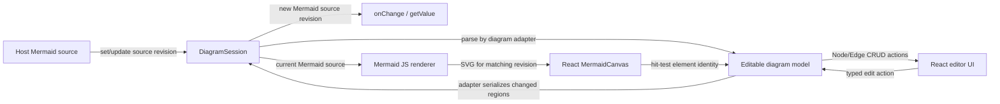

# React 전환 사전 설계

## 설계 방향

React 전환의 기준은 React component를 현재 imperative editor에 씌우는 것이 아니라, Mermaid source와 편집 가능한 diagram model을 함께 관리하는 세션을 만들고 React UI가 그 세션을 조작하도록 하는 것이다.

한 `DiagramSession`은 다음 두 표현을 함께 관리한다.

- **`MermaidCodeBlock`:** SDK가 입력받고 외부로 돌려주는 Mermaid 코드 블록 하나. 주석, 설정, 공백, 지원하지 않는 문법 등 구조 model이 직접 다루지 않는 원문도 보존한다.
- **`RendererModel`:** 화면 편집에 사용하는 diagram별 구조. Flowchart, Class, State, ER 등 graph 계열은 Node와 Edge로 구성하며, 각 요소에 Create·Update·Delete 동작을 제공한다. 다른 diagram은 해당 문법의 의미 요소를 사용한다.

`MermaidCodeBlock`은 현재 `RendererModel` 및 revision을 참조하고, `RendererModel`은 자신을 만든 source revision을 기록한다. 두 표현의 양방향 연결과 수명은 `DiagramSession`이 소유한다. 여기서 renderer model과 Mermaid JavaScript SVG renderer는 별개다. Mermaid JavaScript renderer는 `MermaidCodeBlock`의 source로 preview SVG를 생성한다.

Pie, Gantt, Timeline 등은 각 문법의 의미에 맞는 diagram-specific element를 사용한다. 모든 타입에 같은 Node/Edge 속성이나 interaction을 강제하지 않는다.

사용자 편집은 `RendererModel` 변경으로 표현하고 `MermaidCodeBlock`에 반영한다. 외부에서 code block이 바뀌면 해당 diagram adapter가 source를 파싱해 model을 갱신한다. 세션이 source revision과 model revision을 함께 관리해 두 방향의 갱신을 조정한다.

React component tree가 편집 UI를 소유한다. Mermaid renderer가 생성한 SVG는 별도의 canvas 경계에 표시한다. SSR에서는 source 기반의 안정적인 초기 snapshot으로 editor shell을 만들고 Mermaid DOM rendering은 browser mount 이후에만 수행한다. 이번 task는 이 구조의 설계 문서만 작성하며 React 마이그레이션이나 UI/UX 개선은 구현하지 않는다.



## 현재 코드와 근거

| 영역 | 구현 위치 | 현재 구조 및 설계에 주는 근거 |
|---|---|---|
| Public entry | [`src/index.ts`](../src/index.ts) | `createMermaidVisualEditor`와 public types를 내보낸다. 현재 core 진입점은 React component가 아닌 imperative factory다. |
| Runtime와 UI | [`src/runtime/create-editor.ts`](../src/runtime/create-editor.ts) | DOM UI, instance lifecycle, source 상태, Mermaid render, selection, history, dialog와 event handler가 한 모듈에 모여 있다. React 전환 시 controller와 UI를 분리해야 한다. |
| Public 계약 | [`src/runtime/types.ts`](../src/runtime/types.ts) | Mermaid string `value`, change/selection/error callback, `getValue`, `setValue`, `destroy`를 정의한다. Node/Edge object CRUD는 public API가 아니다. |
| Source model | [`src/source/source-document.ts`](../src/source/source-document.ts) | 원문을 구간별로 다루고 mutation이 안전한 구조화 영역과 opaque 원문을 구분한다. source 보존을 새 model/serializer에서도 유지해야 한다. |
| Diagram capability | [`src/diagrams/capability.ts`](../src/diagrams/capability.ts), [`src/runtime/diagram-catalog.ts`](../src/runtime/diagram-catalog.ts) | 다이어그램 분류, 지원 상태, template, palette를 관리한다. |
| Adapter 계약 | [`src/diagrams/adapter.ts`](../src/diagrams/adapter.ts), [`src/diagrams/register-built-in-adapters.ts`](../src/diagrams/register-built-in-adapters.ts) | 현재 adapter는 toolbar/canvas HTMLElement와 SVG에 결합되어 있고 직접 DOM을 생성·수정한다. React에서는 이 계약을 diagram 동작과 UI 표현으로 나눠야 한다. |
| Diagram source mutation | [`src/source/`](../src/source/) 및 [`src/diagrams/`](../src/diagrams/) | diagram별 source 편집 함수와 렌더된 SVG 선택 동작을 제공한다. 새 model layer는 이 기능을 재사용하는 방향으로 분리한다. |
| Styles | [`src/styles/editor.css`](../src/styles/editor.css) | 현재 UI의 스타일 기준이다. 전환에서는 기존 화면 배치와 스타일을 유지하며 React component에 연결한다. |
| Package/build | [`package.json`](../package.json), [`vite.config.ts`](../vite.config.ts), [`tsconfig.types.json`](../tsconfig.types.json) | 현재 framework-independent SDK의 ESM/CJS/browser IIFE와 CSS 및 type declaration build 구성을 정의한다. |

### 현재 동작과 목표 구조의 차이

현재도 사용자가 Mermaid 코드 블록을 고치면 캔버스가 다시 그려지고, 그래픽 UI에서 다이어그램을 수정하면 코드 블록이 바뀝니다. 이 양방향 사용자 동작은 이미 구현되어 있습니다.

현재 흐름은 `src/runtime/create-editor.ts`의 `handleInput()` → `commitValue()` → `scheduleRender()` 및 Mermaid `render()`로 코드 입력을 캔버스에 반영합니다. 그래픽 편집은 `src/diagrams/adapter.ts`의 `applySourceMutation()`을 통해 diagram adapter가 Mermaid 원문을 변경하고, `commitValue()`가 source editor 값과 캔버스 렌더를 갱신합니다. 관련 구현은 [`create-editor.ts`](../src/runtime/create-editor.ts), [`adapter.ts`](../src/diagrams/adapter.ts), 개별 [diagram adapter](../src/diagrams/)에서 확인할 수 있습니다.

목표 구조와 현재 구현의 차이는 사용자가 보는 양방향 동작이 아니라 내부 표현입니다. 현재는 Mermaid 문자열을 기준으로 adapter가 문자열을 직접 고칩니다. 별도의 Node/Edge `RendererModel`을 `MermaidCodeBlock`과 함께 소유하고 CRUD로 조작하는 계층은 아직 없습니다. 현재 `renderRevision`은 비동기 Mermaid render의 오래된 결과를 버리는 데 사용되지만, source와 별도 model 간 변경을 연결하는 paired revision은 아닙니다. 새 revision 설계는 두 내부 표현을 함께 관리하기 위한 선택이지, 현재 양방향 동작이 없었다는 뜻은 아닙니다. React 전환에서는 이 mental model을 명시적인 session/model 계층으로 만들고 UI를 그 계층에 연결합니다.

## Diagram 범위와 adapter 책임

현재 제공되는 12개 diagram 종류와 실제 편집 동작은 [기존 GUI 지원표](research/support-matrix.md)를 기준으로 한다. React 설계는 그 구현 및 지원표를 링크해 기능을 빠뜨리지 않고, 모든 diagram을 동일한 Node/Edge 구조라고 가정하지 않는다.

| 분류 | 현재 제공되는 유형 | React model 설계 |
|---|---|---|
| 구조 GUI가 있는 graph 유형 | Flowchart, Class, State, ER | diagram adapter가 해당 유형의 Node/Edge schema, 속성, 관계, 식별자 및 CRUD 가능 범위를 정의한다. 현재 동작은 `src/diagrams/*-adapter.ts` 및 해당 `src/source/*-mutations.ts`에서 참조한다. |
| 렌더·palette·source 편집 중심 | Sequence, Gantt, Pie, Journey, Mindmap, Gitgraph, Timeline, Quadrant | 지원표에 기재된 실제 기능을 유지한다. 의미적으로 node/edge에 맞지 않는 요소는 adapter의 diagram별 model로 나타내고, 구현되지 않은 구조 CRUD를 가짜 node/edge 기능으로 만들지 않는다. |

현재 코드의 diagram별 근거: [Flowchart](../src/diagrams/flowchart-adapter.ts) / [source mutations](../src/source/flowchart-mutations.ts), [Sequence](../src/diagrams/sequence-adapter.ts) / [mutations](../src/source/sequence-mutations.ts), [Class](../src/diagrams/class-adapter.ts) / [mutations](../src/source/class-mutations.ts), [State](../src/diagrams/state-adapter.ts) / [mutations](../src/source/state-mutations.ts), [ER](../src/diagrams/er-adapter.ts) / [mutations](../src/source/er-mutations.ts), [Gantt](../src/diagrams/gantt-adapter.ts) / [mutations](../src/source/gantt-mutations.ts), [Pie](../src/diagrams/pie-adapter.ts) / [mutations](../src/source/pie-mutations.ts), [Journey](../src/diagrams/journey-adapter.ts) / [mutations](../src/source/journey-mutations.ts), [Mindmap](../src/diagrams/mindmap-adapter.ts) / [mutations](../src/source/mindmap-mutations.ts), [Gitgraph](../src/diagrams/gitgraph-adapter.ts) / [mutations](../src/source/gitgraph-mutations.ts), [Timeline](../src/diagrams/timeline-adapter.ts) / [mutations](../src/source/timeline-mutations.ts), [Quadrant](../src/diagrams/quadrant-adapter.ts) / [mutations](../src/source/quadrant-mutations.ts).

Diagram adapter는 다음 책임을 가진다.

- Mermaid source를 해당 diagram model로 파싱하고 진단 정보를 제공한다.
- diagram별 Node, Edge 또는 의미 요소의 속성과 관계를 정의한다.
- 유효성 검사를 포함해 필요한 필드로 요소를 생성하고, 일부 속성을 갱신하며, 요소를 삭제하는 연산을 제공한다.
- model 변경을 source mutation으로 직렬화하면서 바뀌지 않은 원문 구간을 보존한다.
- React palette, selection editor, toolbar가 표시할 capability와 form description을 제공한다.
- Mermaid SVG에 대한 hit-testing 및 drag/click event를 model ID와 연결한다. DOM event handler를 계속 사용하는 부분은 React가 소유한 SVG canvas 경계 안에 제한한다.

Core controller는 adapter가 제공하는 typed `createNode`, `updateNode`, `deleteNode`, `createEdge`, `updateEdge`, `deleteEdge` 연산을 선택 가능한 기능으로 노출한다. Diagram type에 해당 연산이나 요소가 없으면 capability에서 제공하지 않는다. 각 연산은 필수 속성, 참조 무결성, 삭제 시 종속 요소 처리 등 diagram별 validation을 adapter에 위임한다.

## 목표 구조

```text
src/
  index.ts                         core contracts and imperative compatibility exports
  core/
    diagram-session.ts             source/model revision과 두 방향 변경을 조정
    diagram-model.ts               diagram type별 editable model contracts
    editor-controller.ts           actions, selection, history, status, notifications
  source/
    source-document.ts             raw source spans 및 opaque regions 보존
    mutations/                     diagram별 Mermaid source mutation
  diagrams/
    registry.ts                    diagram adapter 및 capability registry
    adapters/<diagram>.ts          parse, validate, CRUD, serialize, SVG mapping
  renderer/
    mermaid-renderer.ts            pinned Mermaid 초기화 및 SVG rendering
  ui/
    MermaidEditor.tsx              공개 React editor component
    hooks/useDiagramSession.ts     session snapshot 구독 및 action 연결
    components/
      EditorShell.tsx              기존 레이아웃의 React shell
      ToolSidebar.tsx              좌측 생성 도구 목록과 도구 선택 상태
      DiagramPalette.tsx           선택한 도구가 제공하는 diagram별 요소·액션
      MermaidCanvas.tsx            Mermaid SVG 표시 및 pointer interaction
      SourceEditor.tsx             Mermaid source 편집
      SelectionEditor.tsx          선택 요소 속성의 생성·수정·삭제 UI
      EditorStatus.tsx             parse, render, unsupported, editing 상태
    diagrams/<diagram>/            diagram별 palette/form UI가 필요한 경우 분리
  legacy/
    create-editor.ts               기존 imperative API 호환 entry
  styles/editor.css                기존 사용자 화면 스타일
```

### 계층별 역할

| 계층 | 책임 | React 의존성 |
|---|---|---|
| `source` | 원문 구간, parse source, 보존 가능한 mutation, source 출력 | 없음 |
| `diagrams` | diagram별 model/schema, capability, validation, CRUD, Mermaid source 직렬화, SVG-to-ID mapping | 없음. React UI metadata만 반환 |
| `core/diagram-session` | Mermaid source와 editable model을 한 session에서 연결하고 변경 revision 및 origin을 관리 | 없음 |
| `renderer` | Mermaid source를 SVG로 변환하고 렌더 결과·오류를 보고 | 없음 |
| `core/editor-controller` | session actions, history, selection, status와 외부 callback을 조정 | 없음 |
| `ui` | shell, 좌측 생성 도구, palette, canvas, source editor, 속성 form, status를 React로 render하고 controller state를 [`useSyncExternalStore`](https://react.dev/reference/react/useSyncExternalStore)로 구독 | React runtime |
| `legacy` | 기존 `createMermaidVisualEditor()` lifecycle 계약을 유지하는 adapter | 기존 소비 계약 유지. 새 React component와 DOM subtree를 공유하지 않음 |

React UI는 React 18 이상을 peer dependency로 요구하고 package의 `./react` entry로 분리한다. 기존 framework-independent entry와 browser IIFE는 React를 설치하지 않고 계속 사용할 수 있게 한다. React app은 `mermaid-visual-editor-sdk/react`와 `mermaid-visual-editor-sdk/style.css`를 사용한다. React가 Node/Edge 상태와 Mermaid 문자열을 따로 소유하지 않도록 session/controller snapshot을 유일한 UI 상태 입력으로 둔다. External store hook에는 cached immutable snapshot과 unsubscribe cleanup을 제공한다. SSR/hydration에서는 동일한 source 기반 초기 snapshot을 사용하고 Mermaid SVG는 client mount 후 생성한다.

### 기능 명세: 주체·동작·결과

| 주체 | 무엇을 하는가 | 처리 | 결과 |
|---|---|---|---|
| Host 애플리케이션 | 초기 Mermaid 코드 블록을 전달하거나 이후 새 값을 전달한다. | `DiagramSession`이 `MermaidCodeBlock`을 갱신하고 현재 diagram adapter가 `RendererModel`을 만든다. Mermaid JS renderer가 source를 그린다. | React UI의 source 영역과 캔버스가 입력값을 표시한다. 외부 값 적용을 사용자 변경 callback으로 되돌려 보내지 않는다. |
| 사용자 | `SourceEditor`에서 Mermaid 코드를 입력·수정한다. | 코드 블록을 갱신하고 adapter가 model을 다시 만든다. Mermaid JS renderer가 새 source를 SVG로 렌더한다. | 입력한 코드가 유지되고 `MermaidCanvas`에 같은 다이어그램이 표시된다. parse 오류면 source를 보존하고 오류 상태를 보여 준다. |
| 사용자 | `ToolSidebar`에서 생성 도구 종류를 선택한다. | 선택 상태를 갱신하고 해당 diagram/type의 `DiagramPalette` 항목을 표시한다. | 사용 가능한 생성 도구와 현재 선택 도구가 좌측 사이드바에 드러난다. |
| 사용자 | `DiagramPalette`에서 요소를 선택하고 캔버스에서 생성 위치·연결 대상을 지정한다. | adapter가 해당 diagram의 필수 속성과 관계를 검증한 뒤 `RendererModel`에 Node, Edge 또는 diagram별 요소를 Create한다. model 변경을 Mermaid source로 직렬화한다. | 코드 블록이 바뀌고 Mermaid 렌더 결과가 갱신된다. 지원하지 않는 생성 동작은 해당 도구로 노출하지 않는다. |
| 사용자 | `MermaidCanvas`에서 요소를 선택하거나 이동·연결 등 지원되는 조작을 한다. | SVG hit-test 결과를 model ID에 연결하고 adapter가 유효성 검사를 거쳐 model을 Update한다. | 선택·배치·연결 결과가 캔버스와 Mermaid 코드 양쪽에 반영된다. |
| 사용자 | `SelectionEditor`에서 선택 요소의 속성을 변경하거나 삭제한다. | diagram별 schema에 따라 Update 또는 Delete를 수행한다. 삭제 시 관계·종속 요소는 해당 adapter 규칙을 따른다. | 변경된 속성 또는 삭제 결과가 코드 블록과 캔버스에 반영된다. |
| Diagram adapter / session | CRUD 이후 source를 갱신하고 Mermaid JS renderer에 렌더를 요청한다. | source/model revision과 변경 origin을 기록해 동일 변경이 되울림되지 않게 한다. model이 다루지 않는 source spans는 보존한다. | React UI, code block, preview가 같은 revision의 다이어그램을 나타낸다. |
| SDK | source parsing 또는 SVG rendering에 실패한다. | 실패한 source는 덮어쓰지 않고 진단을 보고한다. 마지막 유효 렌더가 있으면 새 source와 다른 상태임을 표시한다. | `EditorStatus`에서 오류를 확인할 수 있고 사용자는 source를 수정해 복구할 수 있다. |

이 표는 현재 UI가 이미 제공하는 source↔캔버스 반영과 목표 `RendererModel`의 CRUD 흐름을 함께 명시한다. 현재 callback 및 runtime 계약의 근거는 [SDK 계약](decisions/sdk-contract.md), 실제 source input 및 mutation 경로는 [`create-editor.ts`](../src/runtime/create-editor.ts)와 [adapter 계약](../src/diagrams/adapter.ts)이다.

## React UI 구성

- `MermaidEditor`가 하나의 `DiagramSession`과 editor controller를 생성하고 전체 editor lifecycle을 소유한다.
- `useDiagramSession`은 controller의 immutable snapshot과 action API를 React component에 제공한다. session 내부 객체를 직접 수정하지 않는다.
- `EditorShell`은 현재 사용자 화면 구조를 유지하고, `ToolSidebar`, `MermaidCanvas`, `SourceEditor`, `SelectionEditor`, `EditorStatus`를 배치한다.
- `ToolSidebar`는 좌측 생성 도구 진입점과 선택 상태를 소유한다. 선택한 도구에 필요한 diagram별 요소·액션은 `DiagramPalette`가 표시한다.
- `DiagramPalette`와 `SelectionEditor`는 adapter가 선언한 diagram-specific capability와 schema에 따라 표시한다. Flowchart/Sequence/Class 등 모든 diagram에 같은 속성 form을 강제하지 않는다.
- `MermaidCanvas`는 Mermaid renderer의 SVG를 표시하고 hit-testing 결과를 diagram element ID로 변환한다. UI 상태와 CRUD는 controller action으로 전달한다.
- Node/Edge 생성은 현재 diagram type의 필수 속성을 검증한 다음 model에 추가한다. Update는 변경 필드만 전달한다. Delete는 선택 요소의 연결/종속 요소 처리 규칙을 adapter가 적용한다.

UI 위치, 시각 체계 및 편집 흐름은 변경하지 않는다. React component로 옮기는 동안 [UI/UX 와이어프레임](ux-ui/UI-UX-WIREFRAME.md)과 [palette catalog](ux-ui/PALETTE-CATALOG.md)를 기존 화면 계약으로 참고한다.

## 전환 단계

1. **Model 계약 확정:** `DiagramSession`, Mermaid source/model revision, Node/Edge 및 diagram-specific element contracts, ID와 CRUD 오류 규칙을 정의한다.
2. **Diagram adapter 정리:** 12개 현재 제공 diagram을 지원표 기준으로 나누고, parse/capability/source mutation/serialize/SVG mapping을 DOM UI에서 분리한다.
3. **양방향 session 구현 설계:** 기존 source document 보존 기능과 diagram adapter를 연결하고, 외부 source 변경과 model 편집 결과를 구분하는 revision/origin 규칙을 만든다.
4. **React UI 구조 작성:** 현재 UI 레이아웃을 component tree로 옮기고, 공통 component와 diagram별 palette/form의 분리 기준을 적용한다.
5. **호환 경계 확정:** 기존 imperative API, React `./react` export, browser IIFE 및 optional peer dependency 관계를 package 계약에 반영한다.
6. **검증 설계:** 12개 diagram의 실제 지원 기능, source fidelity, CRUD, 외부 source update, parse/render error, selection 및 UI lifecycle을 확인할 검증 항목을 정리한다. 이 task에서는 구현 테스트를 실행하지 않는다.

## 위험 및 결정

| 항목 | 설계 결정 |
|---|---|
| Mermaid source와 model이 서로 다른 내용이 됨 | `DiagramSession`이 두 revision과 변경 origin을 관리한다. React component가 별도 복제 상태를 만들지 않는다. |
| 파싱/직렬화 과정에서 원문을 잃음 | `SourceDocument`의 source span 및 opaque region 보존 방식을 model mutation/serialization에도 적용한다. 보존이 증명되지 않은 region은 구조 편집 대상에서 제외한다. |
| 각 diagram의 의미가 generic Node/Edge에 맞지 않음 | Diagram-specific schema와 capability를 사용한다. 현재 실제로 제공되는 CRUD만 활성화하고 모든 유형에 graph operation을 가정하지 않는다. |
| renderer SVG element와 model ID 연결이 불안정 | 각 adapter가 Mermaid SVG 구조를 source/model ID로 매핑하고 중복 요소의 occurrence/source span을 처리한다. |
| 현재 DOM-bound adapter를 React에서 그대로 사용할 수 없음 | adapter의 UI 생성 책임을 분리하고, React가 palette와 form을 소유한다. SVG pointer binding은 canvas adapter 경계에 한정한다. |
| React Strict Mode에서 session/listener가 중복됨 | effect cleanup과 controller/renderer/adapter dispose를 대칭으로 구현한다. React `useEffect`는 [외부 시스템 연동](https://react.dev/reference/react/useEffect)에 사용하고 Strict Mode의 추가 setup/cleanup cycle을 지원한다. |
| React가 아닌 기존 consumer 호환성 | React entry를 `./react`로 분리하고 기존 imperative entry 및 IIFE에 React peer dependency를 요구하지 않는다. |
| UI 전환 중 디자인 변경이 섞임 | 기존 CSS와 와이어프레임을 기준으로 component만 교체한다. 별도 시각 개선은 task 범위 밖이다. |

## 기준 구현과 의도적 차이

Upstream 기준 구현은 VS Code Extension의 [`extension.js`](https://github.com/NextGenPowerToys/mermaid-visual-editor/blob/8f9bbc90f9f33a13cb5e2eda44100856795c4c01/vscode-extension/extension.js)와 Mermaid bundle을 포함한 단일 [`mermaid-editor.html`](https://github.com/NextGenPowerToys/mermaid-visual-editor/blob/8f9bbc90f9f33a13cb5e2eda44100856795c4c01/vscode-extension/media/mermaid-editor.html) 구조다. [Upstream README](https://github.com/NextGenPowerToys/mermaid-visual-editor/tree/8f9bbc90f9f33a13cb5e2eda44100856795c4c01)에는 Mermaid source 편집, multi-sheet, save-back, SVG/PNG export 등 Extension workflow가 포함된다.

이 SDK는 기존 설계대로 Markdown block 탐색, multi-sheet, VS Code API, 파일 저장 및 Extension UI를 host 책임으로 유지한다. React target은 SDK editor surface와 data model을 React로 구성하고 위 Extension 기능은 옮기지 않는다. 단일 HTML을 감싸는 대신 현재 source mutation과 Mermaid 의존성을 재사용하는 modular model/session 구조를 설계한다. 이는 SDK를 여러 host에 embed하기 위한 의도된 차이다. 배경 근거는 [SDK 추출 설계](mermaid-editor-sdk/DESIGN.md), [baseline 조사](research/baseline-source.md), [host bridge 조사](research/host-bridge.md), [build 구조 결정](decisions/build-architecture.md)에 있다.

현재 코드에는 이 문서에서 정한 양방향 diagram model과 React UI가 아직 없다. 이 문서는 그 목표 구조와 현재 구현에서 분리해야 할 책임을 설계하며, React migration 구현이나 기존 12개 diagram 지원을 확장하지 않는다.

## 완료 추적 체크리스트

아래에서 **설계 준비**는 이 문서에서 완료한 항목이고, **구현 진행**은 React migration task에서 완료할 항목이다. 한 항목은 해당 산출물이나 동작이 확인되면 체크한다.

### 설계 준비

- [x] 현재 source 입력과 그래픽 편집의 양방향 반영 경로를 코드 링크와 함께 기록한다.
- [x] 주체·동작·처리·결과 형식의 기능 명세표를 작성한다.
- [x] `MermaidCodeBlock`과 `RendererModel`의 관계 및 CRUD 책임을 정리한다.
- [x] 현재 제공되는 12개 diagram의 코드와 지원표 링크를 연결한다.
- [x] `src/ui/` 구조와 좌측 `ToolSidebar` 등 React UI 구성요소를 정의한다.
- [x] upstream과 SDK 경계의 의도적 차이를 기록한다.

### Core model과 동기화

- [ ] `MermaidCodeBlock`과 `RendererModel`의 public/internal 타입 경계를 확정한다.
- [ ] `DiagramSession`에서 두 모델의 참조와 lifecycle을 구현한다.
- [ ] source/model revision과 변경 origin 규칙을 구현한다.
- [ ] Node·Edge 및 diagram별 요소의 안정적인 ID 규칙을 구현한다.
- [ ] diagram adapter의 parse·validate·CRUD·serialize 계약을 구현한다.
- [ ] Host source 변경을 `RendererModel`에 반영한다.
- [ ] Node·Edge Create를 model과 Mermaid source에 반영한다.
- [ ] Node·Edge Update를 model과 Mermaid source에 반영한다.
- [ ] Node·Edge Delete 및 종속 요소 처리를 model과 Mermaid source에 반영한다.
- [ ] opaque source span을 보존하며 변경 구간만 직렬화한다.
- [ ] parse 오류에서도 입력 source를 보존하고 복구 가능한 상태를 제공한다.
- [ ] Mermaid SVG element와 model ID의 mapping을 구현한다.
- [ ] stale Mermaid render 결과가 최신 세션 상태를 덮어쓰지 않게 한다.
- [ ] history와 undo/redo가 source와 model 양쪽에서 같은 변경 단위를 사용하게 한다.

### Diagram adapter

- [ ] Flowchart adapter의 현재 Node·Edge·subgraph 편집 기능을 model CRUD에 연결한다.
- [ ] Class adapter의 class·member·relation 편집 기능을 현재 지원 범위대로 연결한다.
- [ ] State adapter의 state·transition 편집 기능을 현재 지원 범위대로 연결한다.
- [ ] ER adapter의 entity·attribute·relationship 편집 기능을 현재 지원 범위대로 연결한다.
- [ ] Sequence adapter의 현재 palette/source 편집 기능을 지원표 기준으로 연결한다.
- [ ] Gantt adapter의 현재 palette/source 편집 기능을 지원표 기준으로 연결한다.
- [ ] Pie adapter의 현재 palette/source 편집 기능을 지원표 기준으로 연결한다.
- [ ] Journey adapter의 현재 palette/source 편집 기능을 지원표 기준으로 연결한다.
- [ ] Mindmap adapter의 현재 palette/source 편집 기능을 지원표 기준으로 연결한다.
- [ ] Gitgraph adapter의 현재 palette/source 편집 기능을 지원표 기준으로 연결한다.
- [ ] Timeline adapter의 현재 palette/source 편집 기능을 지원표 기준으로 연결한다.
- [ ] Quadrant adapter의 현재 palette/source 편집 기능을 지원표 기준으로 연결한다.

### React UI와 package 연결

- [ ] `ui/MermaidEditor.tsx`가 session/controller lifecycle을 소유한다.
- [ ] `ui/hooks/useDiagramSession.ts`가 안정된 snapshot과 action을 구독한다.
- [ ] `EditorShell`이 기존 레이아웃과 화면 영역을 구성한다.
- [ ] `ToolSidebar`에 현재 좌측 생성 도구 목록과 도구 선택 상태를 표시한다.
- [ ] `DiagramPalette`에 선택한 도구의 diagram별 요소와 액션을 표시한다.
- [ ] `MermaidCanvas`가 최신 SVG와 선택·drag·연결 interaction을 표시한다.
- [ ] 캔버스 확대·축소·Fit·Center 등 기존 toolbar 동작을 옮긴다.
- [ ] `SourceEditor`가 code block 편집과 model 갱신을 연결한다.
- [ ] `SelectionEditor`가 선택 요소의 diagram별 속성, 생성·수정·삭제를 제공한다.
- [ ] `EditorStatus`가 loading, parse/render error, unsupported, editing 상태를 표시한다.
- [ ] 필요한 diagram별 palette/form만 `ui/diagrams/<diagram>/`에 분리한다.
- [ ] 기존 CSS와 와이어프레임에 맞춰 화면 동작을 옮기고 UX 재설계를 범위에서 제외한다.
- [ ] 기존 imperative API와 browser IIFE 소비 경로를 호환시킨다.
- [ ] React entry, peer dependency, declarations 및 stylesheet export를 package에 연결한다.
- [ ] SSR/hydration에서 초기 snapshot을 일치시키고 browser 전용 renderer lifecycle을 분리한다.

### 동작 완료 확인

- [ ] Mermaid 코드 입력 후 같은 내용이 캔버스에 표시된다.
- [ ] 좌측 도구 선택과 diagram별 생성 도구가 현재 diagram capability와 일치한다.
- [ ] 지원되는 Node·Edge 생성·수정·삭제가 코드 블록과 캔버스에 함께 반영된다.
- [ ] 외부 source 갱신이 model과 캔버스에 반영되고 callback 되울림이 없다.
- [ ] 현재 지원표의 12개 diagram 기능이 누락되거나 임의로 확대되지 않는다.
- [ ] parse 오류, render 오류, 미지원 상태에서 source 보존과 상태 표시가 명세와 일치한다.
- [ ] 주석·설정·공백 등 편집 대상이 아닌 원문이 유지된다.
- [ ] React mount/unmount, 재마운트, 여러 editor instance에서 cleanup과 상태가 독립적이다.
- [ ] React 사용 문서와 task 35 상태가 최종 package 구조와 일치한다.
