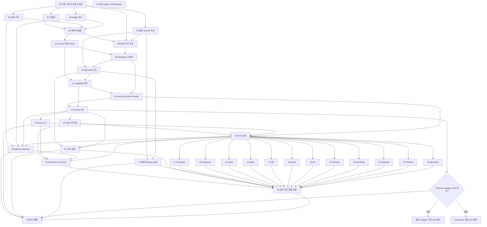

# SDK 추출 작업 순서

[설계 문서](mermaid-editor-sdk/DESIGN.md)의 완료 조건을 조사, 상세 설계, 구현, 배포 검증 단위로 나눴다. 각 작업의 목적과 완료 기준은 [tasks 디렉터리](tasks/)의 개별 문서가 기준이다.

## 실행 원칙

- 조사와 상세 설계도 구현과 같은 수준의 완료 가능한 산출물로 관리한다.
- 병렬 작업은 선행 계약과 공유 경계를 먼저 확정한 뒤 시작한다.
- source 손실 가능성을 발견하면 fixture로 재현하고, 보존이 증명되지 않은 construct는 GUI 편집을 제한한다.
- 완료 상태는 각 개별 task 문서의 `상태` 항목에서 갱신하고, 전체 진행 상황은 이 문서 맨 아래 `진행 체크리스트`에서 갱신한다.

## 결과물 저장 위치

조사·설계·검증 결과처럼 코드가 아닌 산출물은 아래 경로의 Markdown 문서로 저장한다. 구현 task의 결과물은 코드이며, 각 카드에서 테스트·fixture·package notice가 추가되는 경우도 구분했다. 아래 문서들은 해당 task를 수행할 때 생성한다.

| 작업 | 결과 위치 |
|---|---|
| 01–05 | 각각 `docs/research/baseline-source.md`, `support-matrix.md`, `injected-options.md`, `host-bridge.md`, `provenance-license.md` |
| 06–08 | 각각 `docs/decisions/sdk-contract.md`, `source-fidelity.md`, `build-architecture.md` |
| 09–29, 31, 37 | 코드 (카드에 테스트·fixture가 명시된 경우 함께 추가) |
| 32 | `docs/validation/csp-browser.md` 및 필요한 재현 코드 |
| 34 | `docs/validation/distribution-license-audit.md` 및 package license notice |
| 35 | `docs/decisions/react-wrapper.md` |
| 36 | `docs/validation/release-validation.md` |
| 33 | `docs/consumer-guide.md` 및 실행 가능한 예제 코드 |

## 순서

| ID | 작업 | 선행 | 산출물 |
|---|---|---|---|
| 01 | [기준 구현과 저장소 확인](tasks/01-baseline-source.md) | — | 고정 upstream 커밋의 주요 파일과 실제 작업 저장소 구조를 확인한다. |
| 02 | [기존 GUI 지원표](tasks/02-support-matrix.md) | 01 | README와 코드에서 12종 diagram별 실제 GUI 편집 동작을 조사한다. |
| 03 | [주입 설정 조사](tasks/03-injected-options.md) | 01 | buildEditorHtml()의 문자열 설정 주입과 소비 위치를 조사한다. |
| 04 | [host bridge 조사](tasks/04-host-bridge.md) | 01 | 메시지와 DOM 계약에서 editor 기능과 host 전용 기능을 구분한다. |
| 05 | [출처·의존성·license 조사](tasks/05-provenance-license.md) | 01 | 고정 기준 산출물의 Mermaid 버전, 포함물과 고지를 대조한다. |
| 06 | [SDK 계약 상세화](tasks/06-contracts.md) | 02, 03, 04 | container 수명, callback 시점, 입력·오류·option 타입 등 초안의 미결 규칙을 정한다. |
| 07 | [source 보존 기준과 fixture](tasks/07-fidelity-spec.md) | 02, 06 | 지원 유형별 보존 대상 문법과 mutation 후 기대 결과를 구체화한다. |
| 08 | [build 및 모듈 구조 조사](tasks/08-build-architecture-research.md) | 01, 05, 06 | 대상 저장소와 기준 HTML을 비교해 editor 분리·bundle·타입 선언 방식을 결정한다. |
| 09 | [package scaffold](tasks/09-package-scaffold.md) | 08 | 합의한 package exports, browser build, 타입 선언 생성을 구성한다. |
| 10 | [Mermaid 의존성 고정](tasks/10-mermaid-dependency.md) | 05, 08, 09 | 버전 고정, bundle 포함 방식, license notice 연결을 구현한다. |
| 11 | [diagram capability 분류](tasks/11-type-capability.md) | 07, 09, 10 | 렌더 가능성, parse 오류, GUI 편집 지원을 분리 판정한다. |
| 12 | [source 보존 document model](tasks/12-source-document-model.md) | 07, 11 | 구조화된 영역과 opaque 원문을 연결해 안전한 변경 범위를 계산한다. |
| 13 | [runtime lifecycle API](tasks/13-runtime-lifecycle.md) | 06, 09, 11, 12 | container 생성, getValue, destroy 등 editor runtime 핵심을 구현한다. |
| 14 | [setValue 및 callback](tasks/14-external-value-sync.md) | 13 | host 업데이트와 내부 편집 변경의 되울림 없는 동기화를 구현한다. |
| 15 | [source 편집과 상태 UI](tasks/15-editor-states-ui.md) | 11, 12, 13 | source 편집, preview, parse 오류와 GUI 미지원 상태를 연결한다. |
| 16 | [공통 GUI shell](tasks/16-diagram-shell.md) | 12, 13, 15 | type adapter가 공유하는 canvas, 도구 영역, 선택 및 source 반영 경계를 만든다. |
| 17 | [Flowchart adapter](tasks/17-flowchart-adapter.md) | 16 | 기준 구현의 flowchart GUI 흐름을 옮긴다. |
| 18 | [Sequence adapter](tasks/18-sequence-adapter.md) | 16 | 기준 구현의 sequence 편집을 옮긴다. |
| 19 | [Class adapter](tasks/19-class-adapter.md) | 16 | 기준 구현의 class 편집을 옮긴다. |
| 20 | [State adapter](tasks/20-state-adapter.md) | 16 | 기준 구현의 state 편집을 옮긴다. |
| 21 | [ER adapter](tasks/21-er-adapter.md) | 16 | 기준 구현의 ER 편집을 옮긴다. |
| 22 | [Gantt adapter](tasks/22-gantt-adapter.md) | 16 | 기준 구현의 Gantt 편집을 옮긴다. |
| 23 | [Pie adapter](tasks/23-pie-adapter.md) | 16 | 기준 구현의 pie 편집을 옮긴다. |
| 24 | [Journey adapter](tasks/24-journey-adapter.md) | 16 | 기준 구현의 journey 편집을 옮긴다. |
| 25 | [Mindmap adapter](tasks/25-mindmap-adapter.md) | 16 | 기준 구현의 mindmap 편집을 옮긴다. |
| 26 | [Gitgraph adapter](tasks/26-gitgraph-adapter.md) | 16 | 기준 구현의 gitgraph 편집을 옮긴다. |
| 27 | [Timeline adapter](tasks/27-timeline-adapter.md) | 16 | 기준 구현의 timeline 편집을 옮긴다. |
| 28 | [Quadrant adapter](tasks/28-quadrant-adapter.md) | 16 | 기준 구현의 quadrant 편집을 옮긴다. |
| 29 | [typed options와 selection](tasks/29-options-selection.md) | 03, 04, 06, 13, 16 | 검증된 설정을 typed option에 연결하고 selection callback을 구현한다. |
| 31 | [Extension consumer 전환](tasks/31-extension-consumer.md) | 13–16, 29 | 기존 Extension의 editor 실행부를 SDK로 바꾸고 block 탐색/저장을 host에 둔다. |
| 32 | [CSP 브라우저 검증](tasks/32-csp-browser-validation.md) | 10, 13, 16 | browser bundle을 consumer CSP에서 실행해 unsafe-eval 요구를 확인한다. |
| 34 | [배포 license audit](tasks/34-distribution-license-audit.md) | 05, 10 | 실제 package 산출물의 코드/자산과 제3자 고지를 대조한다. |
| 35 | [React wrapper 결정](tasks/35-react-wrapper-decision.md) | 13 | core API와 consumer 수요를 확인한 뒤 wrapper 여부를 판단한다. |
| 36 | [완료 조건 통합 검증](tasks/36-release-validation.md) | 17–29, 31, 32, 34 | 설계 완료 조건 1–10과 CSP 브라우저 확인을 fixture, browser, Extension, package 결과에 연결한다. |
| 37 | [SDK editor UI Storybook](tasks/37-sdk-ui-storybook.md) | — | 사용자가 지정한 Mermaid NG를 바탕으로 SDK 편집 화면의 레이아웃·색·시각 위계를 확인할 정적 UI Storybook을 제공한다. |
| 33 | [consumer 문서와 예제](tasks/33-consumer-docs.md) | 14, 15, 29, 32, 34–36 | 검증 결과와 최종 API에 맞춰 framework 독립 설치·초기화·동기화·정리 예제를 작성한다. |

## 병렬 및 조건부 흐름

초기 기준 소스 확인 뒤 지원 동작, 설정, host bridge, 출처/라이선스 조사는 병렬 가능하다. 계약 확정 후 source fidelity 명세와 build 조사도 병렬 가능하다. 공통 GUI shell이 완성되면 12개 type adapter는 분리된 범위에서 병렬 진행할 수 있다.

### 조건 분기

- 기준 커밋에 별도 모듈 source/build가 실제로 있으면 08에서 재사용성을 평가한다. 없다면 host-independent HTML 코드를 모듈화하고 Mermaid bundle을 별도 관리한다.
- source mutation의 보존 범위를 fixture로 증명하지 못하면 12에서 해당 문법의 GUI 변경을 제한한다.
- CSP에서 unsafe-eval이 필요하면 의존성 원인을 추적한다. 제거가 불가능하면 재현 조건과 consumer 제한을 문서화한다.
- React wrapper는 수요가 있을 때만 별도 구현 task를 추가한다.

## 진행 체크리스트

- [x] 01 기준 구현과 저장소 확인
- [x] 02 기존 GUI 지원표
- [x] 03 주입 설정 조사
- [x] 04 host bridge 조사
- [x] 05 출처·의존성·license 조사
- [x] 06 SDK 계약 상세화
- [x] 07 source 보존 기준과 fixture
- [x] 08 build 및 모듈 구조 조사
- [x] 09 package scaffold
- [x] 10 Mermaid 의존성 고정
- [x] 11 diagram capability 분류
- [x] 12 source 보존 document model
- [x] 13 runtime lifecycle API
- [x] 14 setValue 및 callback
- [x] 15 source 편집과 상태 UI
- [x] 16 공통 GUI shell
- [x] 17 Flowchart adapter
- [x] 18 Sequence adapter
- [x] 19 Class adapter
- [x] 20 State adapter
- [x] 21 ER adapter
- [x] 22 Gantt adapter
- [x] 23 Pie adapter
- [x] 24 Journey adapter
- [x] 25 Mindmap adapter
- [x] 26 Gitgraph adapter
- [x] 27 Timeline adapter
- [x] 28 Quadrant adapter
- [x] 29 typed options와 selection
- [x] 31 Extension consumer 전환
- [ ] 32 CSP 브라우저 검증
- [ ] 34 배포 license audit
- [ ] 35 React wrapper 결정
- [ ] 36 완료 조건 통합 검증
- [x] 37 SDK editor UI Storybook
- [ ] 33 consumer 문서와 예제
